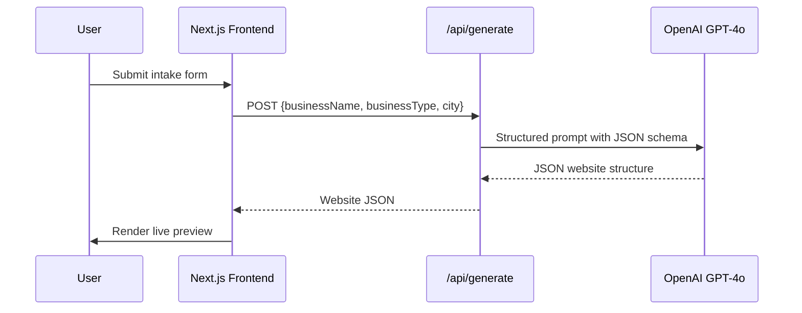

# SiteSpresso — Architecture

> Version: 1.0 | Status: Draft | Date: 2026-06-18

---

## 1. System Overview

```mermaid
graph TD
    subgraph Client
        A[Next.js App\nApp Router]
    end

    subgraph Vercel
        B[Edge Middleware\nSubdomain Router]
        C[API Route Handlers]
        D[Published Site Renderer\n/sites/[slug]]
    end

    subgraph Supabase
        E[(PostgreSQL)]
        F[Supabase Auth]
        G[Supabase Storage\nAssets / Exports]
    end

    subgraph External
        H[OpenAI GPT-4o\nContent Generation]
        I[Stripe\nBilling & Webhooks]
    end

    A -->|Auth| F
    A -->|API calls| C
    B -->|Route {slug}.sitespresso.com| D
    D -->|Read site JSON| E
    C -->|Generate content| H
    C -->|Read/Write data| E
    C -->|Stripe Checkout| I
    I -->|Webhooks| C
    F -->|JWT| E
```

---

## 2. Tech Stack

| Layer | Technology | Rationale |
|---|---|---|
| **Frontend** | Next.js 14 (App Router) | SSR + RSC, file-based routing, API routes in one repo |
| **Styling** | Tailwind CSS | Utility-first, fast iteration, consistent design system |
| **Database** | Supabase (PostgreSQL) | Managed Postgres, RLS, real-time, generous free tier |
| **Auth** | Supabase Auth | Google OAuth, magic link, and email/password, JWT integration with RLS |
| **AI** | OpenAI GPT-4o | Best-in-class structured output, function calling / JSON mode |
| **Billing** | Stripe | Industry standard, Checkout + Portal + Webhooks |
| **Deployment** | Vercel | Native Next.js support, wildcard domains, Edge runtime |
| **Storage** | Supabase Storage | Future-use for images/exports; minimal for MVP |

---

## 3. Database Schema

### `profiles`
Extends Supabase Auth `auth.users`. Created via trigger on sign-up.

```sql
create table public.profiles (
  id          uuid primary key references auth.users(id) on delete cascade,
  email       text not null,
  full_name   text,
  stripe_customer_id text unique,
  plan        text not null default 'free', -- 'free' | 'starter' | 'pro' | 'agency'
  created_at  timestamptz not null default now()
);
```

### `sites`
One site per user for MVP. Extended to many post-MVP.

```sql
create table public.sites (
  id            uuid primary key default gen_random_uuid(),
  user_id       uuid not null references public.profiles(id) on delete cascade,
  slug          text not null unique,
  custom_domain text unique,
  domain_verified boolean not null default false,
  domain_attached boolean not null default false,
  business_name text not null,
  business_type text not null,
  city          text not null,
  content       jsonb not null,        -- AI-generated and user-edited site structure
  status        text not null default 'draft', -- 'draft' | 'published' | 'unpublished'
  published_at  timestamptz,
  created_at    timestamptz not null default now(),
  updated_at    timestamptz not null default now()
);
```

### `subscriptions`
Mirrors Stripe subscription state.

```sql
create table public.subscriptions (
  id                   uuid primary key default gen_random_uuid(),
  user_id              uuid not null references public.profiles(id) on delete cascade,
  stripe_subscription_id text unique not null,
  stripe_price_id      text not null,
  status               text not null,  -- 'active' | 'canceled' | 'past_due' | 'trialing'
  current_period_start timestamptz,
  current_period_end   timestamptz,
  cancel_at_period_end boolean not null default false,
  created_at           timestamptz not null default now(),
  updated_at           timestamptz not null default now()
);
```

### Row-Level Security Policies

```sql
-- profiles: users can read and update their own profile only
alter table public.profiles enable row level security;
create policy "Own profile" on public.profiles
  using (auth.uid() = id);

-- sites: users can CRUD their own sites only
alter table public.sites enable row level security;
create policy "Own sites" on public.sites
  using (auth.uid() = user_id);

-- Published sites readable by everyone (for subdomain rendering)
create policy "Published sites are public" on public.sites
  for select using (status = 'published');

-- subscriptions: users can read their own
alter table public.subscriptions enable row level security;
create policy "Own subscriptions" on public.subscriptions
  using (auth.uid() = user_id);
```

---

## 4. API Design

All routes are Next.js Route Handlers under `/app/api/`.

### `POST /api/generate`
Calls OpenAI and returns website JSON. Available to guests for initial preview; repeat generation is gated in the client flow until sign-in.

**Request:**
```json
{ "businessName": "Joe's Barber", "businessType": "barbershop", "city": "Brooklyn, NY" }
```

**Response:**
```json
{
  "hero": { "headline": "...", "subheadline": "...", "cta": "Book Now" },
  "about": { "title": "About Us", "body": "..." },
  "services": [{ "name": "Haircut", "price": "$30", "description": "..." }],
  "contact": { "phone": "...", "address": "...", "hours": "..." },
  "seo": { "title": "...", "description": "..." }
}
```

### `POST /api/sites`
Creates or updates a site record in Supabase. Requires auth.

### `POST /api/sites/[id]/publish`
Sets site status to `published`, validates active subscription. Requires auth.

### `PATCH /api/sites/[id]/domain`
Saves a custom domain against a site, validates paid entitlement, validates format, and stores `domain_verified = false`. Requires auth and paid plan.

### `POST /api/sites/[id]/domain/verify`
Runs DNS checks for the saved custom domain and updates `domain_verified`. Requires auth and paid plan.

### `POST /api/sites/[id]/domain/attach`
Attaches a verified custom domain to the configured Vercel project and stores `domain_attached = true`. Requires auth and paid plan.

### `POST /api/billing/checkout`
Creates a Stripe Checkout session and returns the URL. Requires auth.

### `POST /api/billing/portal`
Creates a Stripe Billing Portal session and returns the URL. Requires auth.

### `POST /api/webhooks/stripe`
Handles Stripe webhook events. Validates signature. Public (unauthenticated — verified by Stripe signature).

**Handled events:**
- `checkout.session.completed` → activate subscription, mark site published
- `customer.subscription.updated` → sync subscription status
- `customer.subscription.deleted` → set plan to free, unpublish site at period end

---

## 5. AI Generation Pipeline



### System Prompt Template

```
You are a professional website copywriter for local businesses.
Generate a JSON website structure for the following business:
- Business Name: {businessName}
- Business Type: {businessType}
- City: {city}

Return ONLY valid JSON matching this schema:
{
  "hero": { "headline": string, "subheadline": string, "cta": string },
  "about": { "title": string, "body": string },
  "services": [{ "name": string, "price": string, "description": string }],
  "contact": { "phone": string, "address": string, "hours": string },
  "seo": { "title": string, "description": string }
}

Make the content specific to the business type and city. Use professional, friendly tone.
Do not include placeholder or fake data. Use realistic content appropriate for this business.
```

### Safeguards
- Use `response_format: { type: "json_object" }` to enforce valid JSON.
- Validate the returned JSON against a Zod schema before saving.
- If validation fails, return a 422 error and prompt the user to retry.
- Rate-limit the `/api/generate` endpoint by IP and user context to control abuse while preserving onboarding UX.

---

## 6. Authentication

- **Provider:** Supabase Auth
- **Methods:** Google OAuth, Email Magic Link, Email/Password
- **Session handling:** Supabase SSR helper (`@supabase/ssr`) for Next.js App Router — cookies-based session
- **Protected routes:** Middleware checks session cookie; redirects to `/login` if unauthenticated
- **RLS enforcement:** All Supabase queries from server components/route handlers use the user's JWT so RLS policies are always enforced

```
Auth flow:
User → Sign in with Google / Magic Link
→ Supabase Auth issues session cookie
→ Middleware validates on every protected route
→ Server components use createServerClient() with cookie store
→ RLS restricts DB access to own rows
```

---

## 7. Billing

### Stripe Products Setup
- **Product:** SiteSpresso Starter
- **Price:** $9.00/month, recurring
- **Stripe Price ID:** stored in env var `STRIPE_STARTER_PRICE_ID`

### Checkout Flow
1. User clicks "Publish" on free plan → modal appears
2. Frontend calls `POST /api/billing/checkout` with `priceId` and `siteId`
3. API creates Stripe Checkout session with `success_url` and `cancel_url`
4. User is redirected to Stripe-hosted checkout
5. On success, Stripe fires `checkout.session.completed` webhook
6. Webhook handler activates subscription and publishes site

### Webhook Security
- All webhook requests verified via `stripe.webhooks.constructEvent(body, signature, webhookSecret)`
- Raw request body preserved (not parsed) before verification
- Idempotency: webhook handler checks for existing subscription before inserting

### Environment Variables
```
STRIPE_SECRET_KEY=
STRIPE_WEBHOOK_SECRET=
STRIPE_STARTER_PRICE_ID=
NEXT_PUBLIC_STRIPE_PUBLISHABLE_KEY=
```

---

## 8. Subdomain Routing

### Vercel Configuration
- Wildcard domain `*.sitespresso.com` added in Vercel project settings
- DNS: `*.sitespresso.com` → Vercel via CNAME

### Next.js Middleware
```ts
// middleware.ts
export function middleware(request: NextRequest) {
  const hostname = request.headers.get('host') ?? ''
  const isSubdomain = hostname.endsWith('.sitespresso.com') &&
    !hostname.startsWith('www') &&
    !hostname.startsWith('app')

  if (isSubdomain) {
    const slug = hostname.replace('.sitespresso.com', '')
    return NextResponse.rewrite(new URL(`/sites/${slug}`, request.url))
  }
}
```

### Published Site Route
- `/app/sites/[slug]/page.tsx` — server component, reads site JSON from Supabase, renders full page
- Rendered at the Edge for < 200ms TTFB
- Returns 404 if site is not found or not published

---

## 9. Deployment

### Vercel Project Setup
- **Framework preset:** Next.js
- **Environment variables:** set per-environment (preview / production)
- **Domains:** `sitespresso.com`, `www.sitespresso.com`, `app.sitespresso.com`, `*.sitespresso.com`
- **Build command:** `next build`
- **Output:** standard Next.js output (no `output: export`)

### Environments
| Environment | Branch | URL |
|---|---|---|
| Production | `main` | `app.sitespresso.com` |
| Preview | feature branches | `{branch}.sitespresso-git-*.vercel.app` |

### CI/CD
- Push to `main` → automatic Vercel production deploy
- Pull requests → automatic Vercel preview deploy
- No additional CI pipeline needed for MVP

---

## 10. Security Considerations

| Concern | Mitigation |
|---|---|
| **API key exposure** | OpenAI and Stripe keys only used in server-side Route Handlers, never exposed to client |
| **Stripe webhook tampering** | `stripe.webhooks.constructEvent` signature verification on every event |
| **Unauthorized site access** | Supabase RLS enforces row-level ownership; server components use user JWT |
| **Prompt injection** | User input sanitized before inclusion in AI prompt; input length capped at 100 chars per field |
| **Slug hijacking** | Slugs validated as URL-safe, unique constraint in DB, reserved slug list (www, app, api, admin) |
| **Mass generation abuse** | Rate limiting on `/api/generate` per IP and per user |
| **CSRF** | Next.js App Router server actions use built-in CSRF protection; Stripe webhook uses signature |
| **XSS on published sites** | User-edited content rendered via React (auto-escaped); no `dangerouslySetInnerHTML` |
| **SQL injection** | All DB access via Supabase client with parameterized queries |
| **Sensitive data in logs** | No PII or secrets logged; Vercel log drain reviewed before enabling |
