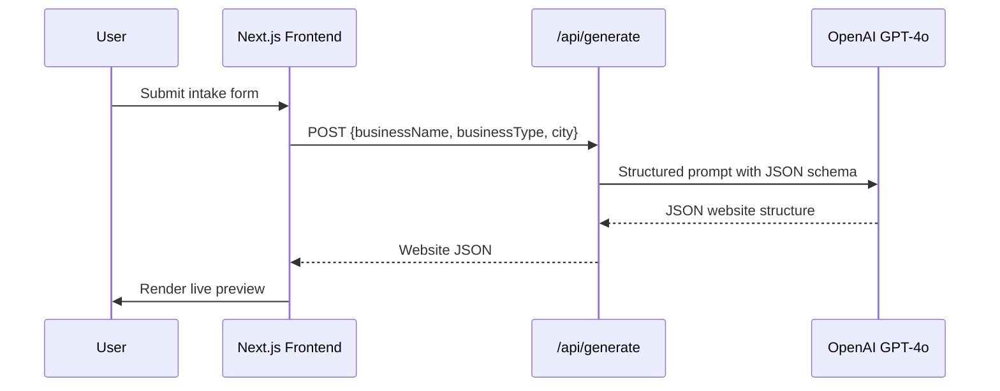

# SiteSpresso — Architecture

> Version: 1.1 | Status: Living document | Originally drafted: 2026-06-18 | Reconciled with code: 2026-09-25
>
> Sections 2, 3 (`sites`), 4, 5, 7 and 9 were updated on 2026-09-25 to match the code on `main` (`50b7d24`). Project status lives in [ROADMAP.md](../ROADMAP.md).

---

## 1. System Overview

```mermaid
graph TD
    subgraph Client
        A[Next.js App\nApp Router]
    end

    subgraph Vercel
        B[Edge Middleware\nHost Router]
        C[API Route Handlers]
        D[Published Site Renderer\n/sites/[slug]]
    end

    subgraph Supabase
        E[(PostgreSQL)]
        F[Supabase Auth]
        G[Supabase Storage\nAssets / Exports]
    end

    subgraph External
        H[OpenAI GPT-4o\nContent Generation]
        I[Stripe\nBilling & Webhooks]
    end

    A -->|Auth| F
    A -->|API calls| C
    B -->|Route {slug}.sitespresso.com and verified custom hosts| D
    D -->|Read site JSON| E
    C -->|Generate content| H
    C -->|Read/Write data| E
    C -->|Stripe Checkout| I
    I -->|Webhooks| C
    F -->|JWT| E
```

---

## 2. Tech Stack

| Layer | Technology | Rationale |
|---|---|---|
| **Frontend** | Next.js 14 (App Router) | SSR + RSC, file-based routing, API routes in one repo |
| **Styling** | Tailwind CSS | Utility-first, fast iteration, consistent design system |
| **Database** | Supabase (PostgreSQL) | Managed Postgres, RLS, real-time, generous free tier |
| **Auth** | Supabase Auth | Google OAuth, email magic link (OTP), and email/password (all three wired in `app/login/page.tsx`), JWT integration with RLS |
| **AI** | OpenAI `gpt-4o` (text, `json_schema` structured output) and `gpt-image-1` (hero images) | Structured output validated with Zod |
| **Billing** | Stripe | Checkout + Portal + Webhooks; 3 paid plans × monthly/annual, billed in **EUR** |
| **Rate limits / quotas** | Redis (`REDIS_URL`) with in-memory fallback | Per-plan monthly generation quotas (`lib/redis/rate-limiter.ts`) |
| **Deployment** | Vercel | Native Next.js support, wildcard domains, Edge runtime |
| **Storage** | Supabase Storage | Logo uploads (`logos` bucket migration) |

---

## 3. Database Schema

### `profiles`
Extends Supabase Auth `auth.users`. Created via trigger on sign-up.

```sql
create table public.profiles (
  id          uuid primary key references auth.users(id) on delete cascade,
  email       text not null,
  full_name   text,
  stripe_customer_id text unique,
  plan        text not null default 'free', -- 'free' | 'starter' | 'pro' | 'agency'
  created_at  timestamptz not null default now()
);
```

### `sites`
Multiple sites per user, capped per plan in `lib/billing/site-limits.ts`: **Free 1, Starter 1, Pro 3, Agency unlimited**. Enforced in `app/api/generate/route.ts`, `components/SitePreview.tsx` (draft insert) and `components/DashboardContent.tsx`. The limit is enforced only in the app. No database constraint, trigger or RLS policy caps sites per user (`Own sites` only checks ownership), and the `SitePreview` check runs client-side before its draft insert.

Other tables added by later migrations: `site_page_views` (analytics), `leads`, `referrals` (see `supabase/migrations/`).

```sql
create table public.sites (
  id            uuid primary key default gen_random_uuid(),
  user_id       uuid not null references public.profiles(id) on delete cascade,
  slug          text not null unique,
  custom_domain text unique,
  domain_verified boolean not null default false,
  domain_attached boolean not null default false,
  business_name text not null,
  business_type text not null,
  city          text not null,
  content       jsonb not null,        -- AI-generated and user-edited site structure
  status        text not null default 'draft', -- 'draft' | 'published' | 'unpublished'
  published_at  timestamptz,
  created_at    timestamptz not null default now(),
  updated_at    timestamptz not null default now()
);
```

### `subscriptions`
Mirrors Stripe subscription state.

```sql
create table public.subscriptions (
  id                   uuid primary key default gen_random_uuid(),
  user_id              uuid not null references public.profiles(id) on delete cascade,
  stripe_subscription_id text unique not null,
  stripe_price_id      text not null,
  status               text not null,  -- 'active' | 'canceled' | 'past_due' | 'trialing'
  current_period_start timestamptz,
  current_period_end   timestamptz,
  cancel_at_period_end boolean not null default false,
  created_at           timestamptz not null default now(),
  updated_at           timestamptz not null default now()
);
```

### Row-Level Security Policies

```sql
-- profiles: users can read and update their own profile only
alter table public.profiles enable row level security;
create policy "Own profile" on public.profiles
  using (auth.uid() = id);

-- sites: users can CRUD their own sites only
alter table public.sites enable row level security;
create policy "Own sites" on public.sites
  using (auth.uid() = user_id);

-- Published sites readable by everyone (for subdomain rendering)
create policy "Published sites are public" on public.sites
  for select using (status = 'published');

-- subscriptions: users can read their own
alter table public.subscriptions enable row level security;
create policy "Own subscriptions" on public.subscriptions
  using (auth.uid() = user_id);
```

---

## 4. API Design

All routes are Next.js Route Handlers under `app/api/`. This list matches the tree on `main` (2026-09-25). Site drafts are created client-side through the Supabase client under RLS (`components/SitePreview.tsx`); there is **no** `POST /api/sites` route (the original draft listed one).

| Method(s) | Route | Purpose | Auth |
|---|---|---|---|
| POST | `/api/generate` | Generate website JSON with OpenAI; enforces per-plan site limit and monthly quota | Guest allowed (free quota); signed-in users get their plan's limits |
| PATCH | `/api/account` | Update profile (display name, email) | User |
| POST | `/api/analytics/pageview` | Record a published-site page view | Public |
| GET | `/api/auth/callback` | Auth callback helper (primary callback is `app/auth/callback/route.ts`) | — |
| POST | `/api/billing/checkout` | Create Stripe Checkout session for `plan` (`starter`/`pro`/`agency`) + `billing` (`monthly`/`annual`); returns 400 if that price isn't configured | User |
| GET | `/api/billing/plans` | Public plan/price availability payload | Public |
| POST | `/api/billing/portal` | Create Stripe Billing Portal session | User |
| GET | `/api/debug/subscription` | Debug: caller's plan/subscription + configured Agency price env values; `no-store` | **Admin only** (`requireAdminSession()`: 401 unauthenticated, 403 non-admin, 500 if the allowlist isn't configured) |
| POST | `/api/leads` | Capture email before anonymous publish | Public |
| POST | `/api/referrals` | Apply a referral code after login | User |
| GET | `/api/referrals/stats` | Referral stats for account page | User |
| DELETE | `/api/sites/[id]/delete` | Delete a site | Owner |
| PATCH | `/api/sites/[id]/domain` | Save custom domain (resets verification) | Owner, paid plan |
| POST | `/api/sites/[id]/domain/verify` | DNS check (CNAME, or A/AAAA for apex) → `domain_verified` | Owner, paid plan |
| POST | `/api/sites/[id]/domain/attach` | Attach verified domain to the Vercel project → `domain_attached` | Owner, paid plan |
| POST, DELETE | `/api/sites/[id]/hero-image` | Generate (OpenAI image) / remove hero image | Owner |
| POST, DELETE | `/api/sites/[id]/logo` | Upload / remove logo | Owner |
| POST | `/api/sites/[id]/publish` | Publish site (slug resolution, paid-plan check) | Owner, paid plan |
| POST | `/api/sites/[id]/refresh-section` | AI-regenerate one section, optional hint | Owner |
| GET | `/api/user/quota` | Current generation quota | User |
| POST | `/api/user/reconcile-billing` | Re-sync plan/subscription from Stripe | User |
| POST | `/api/webhooks/stripe` | Stripe events (signature-verified) | Stripe signature |

Admin UI: `/admin/billing` (page, allowlist-gated). The former `GET /api/admin/billing/duplicates` endpoint was removed in `f21df91`.

### `POST /api/generate` — request / response shape

**Request** (validated by `GenerateInputSchema` in `lib/schemas/website.ts`; strings are sanitised and capped at 100 chars):
```json
{ "business_name": "Joe's Barber", "business_type": "barbershop", "city": "Brooklyn, NY", "language": "en" }
```

**Response** (abridged; the full shape is `WebsiteSchema` in `lib/schemas/website.ts`):
```json
{
  "success": true,
  "website": {
    "business_name": "...", "business_type": "...", "city": "...", "language": "en", "tagline": "...",
    "hero": { "title": "...", "content": "...", "cta_text": "...", "cta_url": "..." },
    "about": { "title": "...", "content": "...", "cta_text": "...", "cta_url": "..." },
    "services": { "title": "...", "description": "...", "items": [{ "name": "...", "description": "..." }] },
    "contact": { "title": "...", "phone": "...", "email": "...", "address": "...", "hours": "..." },
    "color_scheme": { "primary": "#RRGGBB", "secondary": "#RRGGBB", "accent": "#RRGGBB", "neutral": "#RRGGBB" },
    "fonts": { "heading": "...", "body": "..." },
    "logo": { "position": "left", "width": 100 },
    "layout": { "section_order": ["about", "services", "contact"], "section_backgrounds": { "about": "#ffffff", "services": "#f8fafc", "contact": "#ffffff" } },
    "pages": { "home": { }, "about": { }, "contact": { } }
  },
  "remaining": 0,
  "resetTime": 0
}
```

Optional fields added after generation by the editor include `hero.hero_image_url`, `contact.map_embed_url`, `contact.booking_embed_url` and `contact.google_business_profile_embed_url`. Errors: 403 when the site limit is reached, 429 when the quota is exceeded, 500 on generation/validation failure, 503 if OpenAI isn't configured.

### Stripe webhook events

- `checkout.session.completed` → activate subscription, mark site published
- `customer.subscription.updated` → sync subscription status and plan (plan derived from the price ID via `planFromStripeStatus()` in `lib/stripe.ts`)
- `customer.subscription.deleted` → reconcile the profile plan from remaining subscriptions; if it resolves to `free`, published sites are set back to `draft` when the event is processed

---

## 5. AI Generation Pipeline


```mermaid
sequenceDiagram
    participant U as User
    participant FE as Next.js Frontend
    participant API as /api/generate
    participant AI as OpenAI GPT-4o

    U->>FE: Submit intake form
    FE->>API: POST {businessName, businessType, city}
    API->>AI: Structured prompt with JSON schema
    AI-->>API: JSON website structure
    API-->>FE: Website JSON
    FE->>U: Render live preview
```

### System Prompt Template

> Historical draft. The live prompts are in `lib/ai/prompts.ts` (language-aware) and the output shape is enforced with a strict `json_schema` in `app/api/generate/route.ts` (see section 4).

```
You are a professional website copywriter for local businesses.
Generate a JSON website structure for the following business:
- Business Name: {businessName}
- Business Type: {businessType}
- City: {city}

Return ONLY valid JSON matching this schema:
{
  "hero": { "headline": string, "subheadline": string, "cta": string },
  "about": { "title": string, "body": string },
  "services": [{ "name": string, "price": string, "description": string }],
  "contact": { "phone": string, "address": string, "hours": string },
  "seo": { "title": string, "description": string }
}

Make the content specific to the business type and city. Use professional, friendly tone.
Do not include placeholder or fake data. Use realistic content appropriate for this business.
```

### Safeguards
- Use `response_format: { type: "json_schema", strict: true }` to enforce the output shape (code uses `json_schema`, not `json_object`).
- Validate the returned JSON against a Zod schema before saving.
- If validation fails, the route currently returns a 500 with the error message (not 422), after up to 2 retries on OpenAI call failures.
- Rate-limit the `/api/generate` endpoint by IP and user context to control abuse while preserving onboarding UX.

---

## 6. Authentication

- **Provider:** Supabase Auth
- **Methods:** Google OAuth, Email Magic Link, Email/Password
- **Session handling:** Supabase SSR helper (`@supabase/ssr`) for Next.js App Router — cookies-based session
- **Protected routes:** Middleware checks session cookie; redirects to `/login` if unauthenticated
- **RLS enforcement:** All Supabase queries from server components/route handlers use the user's JWT so RLS policies are always enforced

```
Auth flow:
User → Sign in with Google / Magic Link
→ Supabase Auth issues session cookie
→ Middleware validates on every protected route
→ Server components use createServerClient() with cookie store
→ RLS restricts DB access to own rows
```

---

## 7. Billing

### Stripe Products Setup
- **Plans:** Starter, Pro, Agency, each monthly and annual (`lib/stripe.ts`)
- **Currency:** EUR. Default display prices in `lib/billing/plans.ts`: Starter €9/mo · €79/yr, Pro €19/mo · €159/yr, Agency €49/mo · €399/yr; overridden by live Stripe price amounts when available
- **Price IDs:** stored in env vars `STRIPE_STARTER_PRICE_ID`, `STRIPE_STARTER_ANNUAL_PRICE_ID`, `STRIPE_PRO_PRICE_ID`, `STRIPE_PRO_ANNUAL_PRICE_ID`, `STRIPE_AGENCY_PRICE_ID`, `STRIPE_AGENCY_ANNUAL_PRICE_ID`. All six are configured in Vercel Production (owner-confirmed 2026-09-25)

### Checkout Flow
1. User clicks "Publish" on free plan → modal appears
2. Frontend calls `POST /api/billing/checkout` with `plan` and `billing` (the server resolves the price ID from env)
3. API creates Stripe Checkout session with `success_url` and `cancel_url`
4. User is redirected to Stripe-hosted checkout
5. On success, Stripe fires `checkout.session.completed` webhook
6. Webhook handler activates subscription and publishes site

### Webhook Security
- All webhook requests verified via `stripe.webhooks.constructEvent(body, signature, webhookSecret)`
- Raw request body preserved (not parsed) before verification
- Idempotency: webhook handler checks for existing subscription before inserting

### Environment Variables
```
STRIPE_SECRET_KEY=
STRIPE_WEBHOOK_SECRET=
STRIPE_STARTER_PRICE_ID=
STRIPE_STARTER_ANNUAL_PRICE_ID=
STRIPE_PRO_PRICE_ID=
STRIPE_PRO_ANNUAL_PRICE_ID=
STRIPE_AGENCY_PRICE_ID=
STRIPE_AGENCY_ANNUAL_PRICE_ID=
NEXT_PUBLIC_STRIPE_PUBLISHABLE_KEY=
```

---

## 8. Subdomain Routing

### Vercel Configuration
- Wildcard domain `*.sitespresso.com` added in Vercel project settings
- DNS: `*.sitespresso.com` → Vercel via CNAME

### Next.js Middleware

> Simplified original sketch. The real `middleware.ts` also rewrites verified + attached custom domains (cached lookup), preserves page path suffixes (`/about`, `/contact`), reserves `www`, `app`, `api`, `admin`, and protects `/dashboard` and `/admin`.
```ts
// middleware.ts
export function middleware(request: NextRequest) {
  const hostname = request.headers.get('host') ?? ''
  const isSubdomain = hostname.endsWith('.sitespresso.com') &&
    !hostname.startsWith('www') &&
    !hostname.startsWith('app')

  if (isSubdomain) {
    const slug = hostname.replace('.sitespresso.com', '')
    return NextResponse.rewrite(new URL(`/sites/${slug}`, request.url))
  }
}
```

### Published Site Route
- `/app/sites/[slug]/page.tsx` — server component, reads site JSON from Supabase, renders full page
- Rendered at the Edge for < 200ms TTFB
- Returns 404 if site is not found or not published

---

## 9. Deployment

### Vercel Project Setup
- **Framework preset:** Next.js
- **Environment variables:** set per-environment (preview / production)
- **Domains:** `sitespresso.com` and `*.sitespresso.com` are verified in Vercel (owner-confirmed 2026-09-25). `app.sitespresso.com` resolves through the wildcard; `sitespresso.com` is canonical.
- **Build command:** `next build`
- **Output:** standard Next.js output (no `output: export`)

### Environments
| Environment | Branch | URL |
|---|---|---|
| Production | `main` | **`https://sitespresso.com`** (canonical; matches [PRODUCTION_DEPLOYMENT_RUNBOOK.md](PRODUCTION_DEPLOYMENT_RUNBOOK.md) and the `NEXT_PUBLIC_SITE_URL` fallback in code). `app.sitespresso.com` also returns 200 without a redirect, because it's served by the verified `*.sitespresso.com` wildcard; its canonical/robots metadata points to `sitespresso.com`. Whether `app.` should 301 to the apex is an open, owner-approval item ([NEXT_ACTIONS.md](../NEXT_ACTIONS.md) item 7). The GitHub repo homepage field is set to `sitespresso.vercel.app`. |
| Preview | feature branches | Vercel preview deployments |

### CI/CD
- Push to `main` → automatic Vercel production deploy
- Pull requests → automatic Vercel preview deploy
- GitHub Actions (`.github/workflows/`), on push and PR to `main`:
  - `ci.yml`: root app `npm install && npm run build`, plus `templates/react-app` build and a static-template check
  - `build-verify.yml`: `npm ci`, `npx tsc --noEmit`, `npm run lint`, `npm run build`, `.next/static` check
  - `reliability.yml`: `npm ci`, `npm run test:reliability:ci` (PowerShell 7; cloud checks skipped)
- No unit-test framework yet (see [NEXT_ACTIONS.md](../NEXT_ACTIONS.md) item 2)

---

## 10. Security Considerations

| Concern | Mitigation |
|---|---|
| **API key exposure** | OpenAI and Stripe keys only used in server-side Route Handlers, never exposed to client |
| **Stripe webhook tampering** | `stripe.webhooks.constructEvent` signature verification on every event |
| **Unauthorized site access** | Supabase RLS enforces row-level ownership; server components use user JWT |
| **Prompt injection** | User input sanitized before inclusion in AI prompt; input length capped at 100 chars per field |
| **Slug hijacking** | Slugs generated as DNS-safe labels (`[a-z0-9-]`, 1–63 chars, accents transliterated) in `lib/slug-format.ts`; unique constraint in DB; publish rejects the 27 reserved slugs (exact match); middleware never routes the `www`/`app`/`api`/`admin` subdomains to sites |
| **Mass generation abuse** | Per-plan monthly quotas on `/api/generate`, keyed by user or IP (Redis, with in-memory fallback) |
| **CSRF** | Next.js App Router server actions use built-in CSRF protection; Stripe webhook uses signature |
| **XSS on published sites** | User-edited content rendered via React (auto-escaped); no `dangerouslySetInnerHTML` |
| **SQL injection** | All DB access via Supabase client with parameterized queries |
| **Sensitive data in logs** | No PII or secrets logged; Vercel log drain reviewed before enabling |
